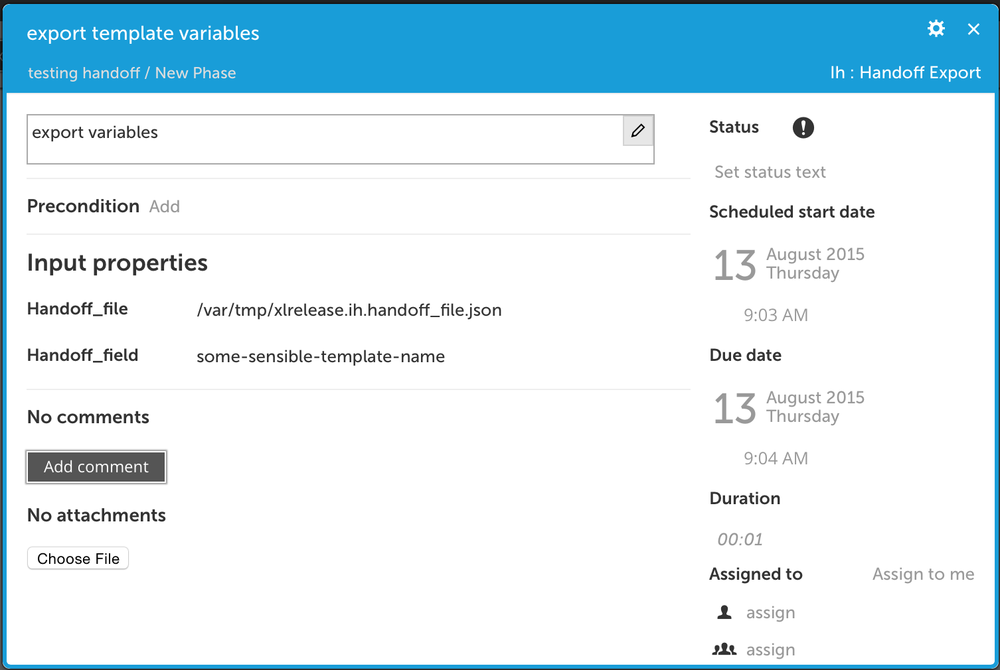
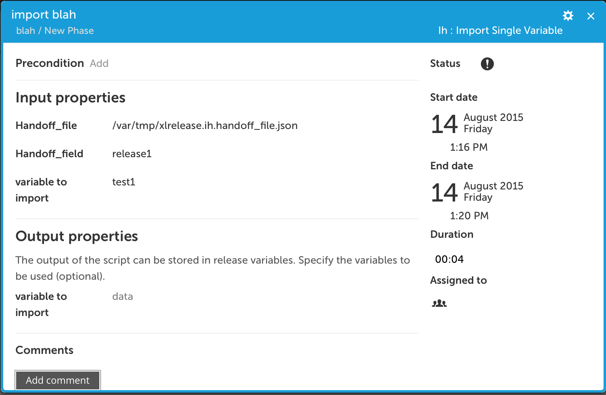
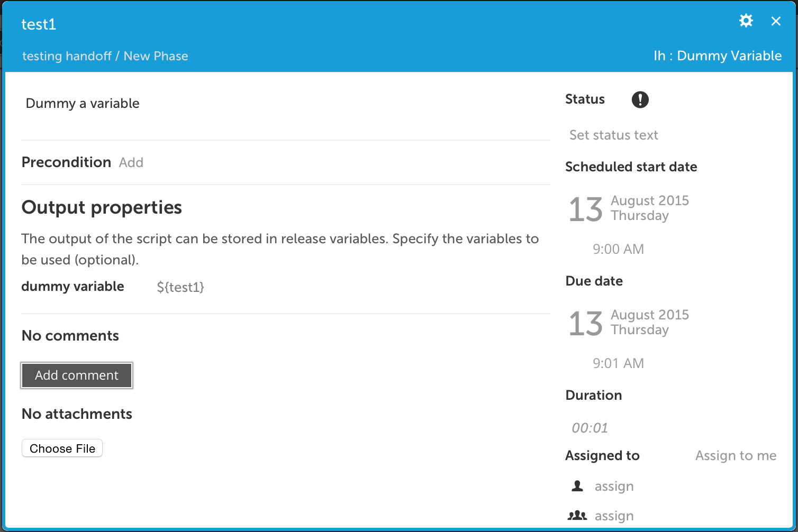
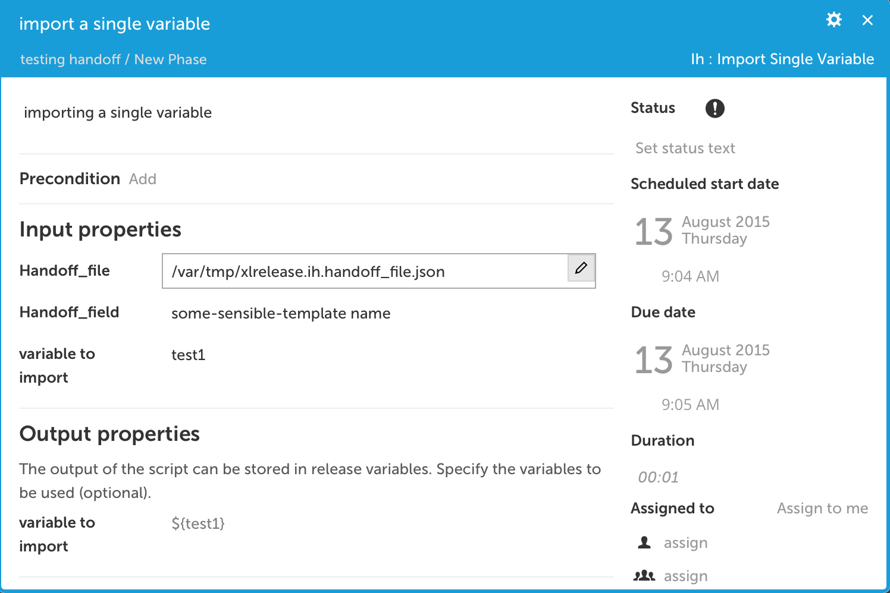

#XL Release variable hand off plugin

## Preface
This document descripts the functionality provide by the `xlr-variable-handoff-plugin`, as well as potential future functionality.

## Overview
This plugin enables users to export the all the variables from one template to a json formatted file somewhere on the system xlr is running on and importing it into another template.
The import can either be done in one go or more selectively by importing one variable at a time.

## Installation
Copy the plugins jar file into the plugin directory of XL Release.

!! this plugin uses the XL Release jython api to modify releases from a scripted tast. This means that the run as user for the template has to set to the admin user.

## Supported Tasks
* [handoff export]
* [handoff import]
* [dummy variable]
* [import single variable]

#### handoff export
Writes the current names and values of all variables in the release to a jython file

**input properties**

* `handoff_file`: Full path to the json file on the filesystem where the variables will be written to
* `handoff_field`: name of the json map in the hand off file which will hold the variables

#### handoff import
imports names and values of variables in a certain json map in the designated json file into the current release

**input properties**

* `handoff_file`: Full path to the json file on the filesystem where the variables will be written to
* `handoff_field`: name of the json map in the hand off file which will hold the variables

#### dummy Variable
Emits a dummy variable with value set to dummy in order to satisfy any required variables needs a template might have before starting the release.

**input properties**

* `dummy_variable`: the variably to be dummied in variable notation (this is an output field)

#### import single variable
import a single variable value from an exported file/map combination .

**input properties**

* `handoff_file`: Full path to the json file on the filesystem where the variables will be written to
* `handoff_field`: name of the json map in the hand off file which will hold the variables
* `variable_name`: the name of the variable to import
* `output_variable_name`: variable to output the value to

## Usage
The typical usecase for this plugin is an environment which is seperated into two seperate "compartments". On compartment (the Continuous build/integration) cranks out a build as soon as new code becomes available and runs on a git/svn/artifactory trigger.
The other compartment (the testing compartment) needs to be deployed at certain time intervals but prefereble with the latest know good release. This plugin enables xlr to solve this problem with two seperate templates that are connected by the export of variables from the build/ci compartment template which will ten get picked up by the time triggerd compartment when it is time to run the template.

## Examples